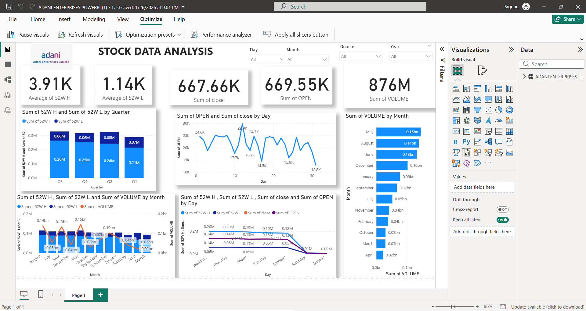

# 📈 Adani Enterprises Stock Market Analytics Dashboard | Power BI

Transforming historical stock market data into actionable business insights using **Microsoft Power BI**.

---

# 📌 Project Overview

Understanding stock market trends requires more than just numbers—it requires meaningful visual insights.

This project presents an **interactive Power BI dashboard** that analyzes the historical performance of **Adani Enterprises Ltd.** The dashboard enables users to explore price movements, trading activity, and long-term market trends through intuitive and interactive visualizations.

Designed with a focus on **clarity, usability, and business intelligence**, the dashboard includes dynamic filters that help users identify patterns and evaluate stock performance across different time periods.

---

# ✨ Key Highlights

* 📊 Interactive Power BI Dashboard with dynamic slicers
* 📅 Analyze stock performance by **Day, Month, Quarter, and Year**
* 📈 Track Opening and Closing Price trends
* 📉 Compare **52-Week High** and **52-Week Low**
* 📦 Monitor Monthly Trading Volume
* 📊 Evaluate Quarterly Stock Performance
* 📌 KPI Cards for quick business insights
* 🎯 Clean, responsive, and user-friendly dashboard design

---

# 📊 Dashboard Metrics

The dashboard provides a quick overview of important stock indicators:

* 📌 Average 52-Week High
* 📌 Average 52-Week Low
* 📌 Total Opening Price
* 📌 Total Closing Price
* 📌 Total Trading Volume

---

# 🛠️ Tech Stack

* Microsoft Power BI
* Microsoft Excel
* Power Query
* DAX (Data Analysis Expressions)
* Data Visualization
* Business Intelligence

---

# 📈 Dashboard Visualizations

This dashboard combines multiple visualization techniques to deliver meaningful business insights.

* KPI Cards
* Line Charts
* Clustered Column Charts
* Combo Charts
* Bar Charts
* Interactive Slicers
* Time-Based Trend Analysis

---

# 📂 Dataset

The dataset contains historical stock market information for **Adani Enterprises Ltd.**, including:

* Date
* Opening Price
* Closing Price
* Trading Volume
* 52-Week High
* 52-Week Low
* Day
* Month
* Quarter
* Year

---

# 🎯 Project Goal

The primary objective of this project is to transform raw stock market data into an interactive **Business Intelligence solution**.

Using Power BI, the dashboard helps users:

* Analyze historical stock performance
* Identify market trends
* Compare performance over time
* Generate data-driven insights through interactive reports

---

# 💡 Skills Demonstrated

This project demonstrates practical experience in:

* ✔ Data Cleaning & Transformation
* ✔ Data Modeling
* ✔ DAX Calculations
* ✔ KPI Development
* ✔ Interactive Dashboard Design
* ✔ Financial Data Analysis
* ✔ Business Intelligence
* ✔ Data Storytelling
* ✔ Analytical Thinking

---

# 📸 Dashboard Preview

Place your dashboard screenshot inside the project folder using the following path:

```
Dashboard.png
```

Then display it in GitHub using:

```markdown

```

### Preview


---

# 📁 Project Structure

```
Adani-Enterprises-Stock-Market-Analytics/
│
├── Adani Enterprises Stock Market Analytics.pbix
├── Dataset.xlsx
├── Dashboard.png
├── README.md
└── Assets/
```

---

# 🌟 Why This Project?

This dashboard demonstrates how **Business Intelligence** can simplify complex financial datasets into clear, interactive, and insightful reports.

The project reflects my ability to:

* Transform raw financial data into meaningful insights
* Design interactive Power BI dashboards
* Build business-focused KPIs
* Apply data storytelling techniques
* Deliver visually appealing analytical reports

---

# 🚀 Future Enhancements

* Add Moving Average Analysis
* Include Candlestick Charts
* Forecast future stock prices
* Compare multiple companies
* Integrate live stock market data
* Add Profit & Loss analysis

---

# ⭐ Support

If you found this project helpful, consider giving it a **⭐ Star** on GitHub.

Feedback, suggestions, and contributions are always welcome!

---

# 👨‍💻 Author

**Ganga A S**

* LinkedIn: *www.linkedin.com/in/ganga-a-s*
* GitHub: *https://github.com/gangakdpr*
